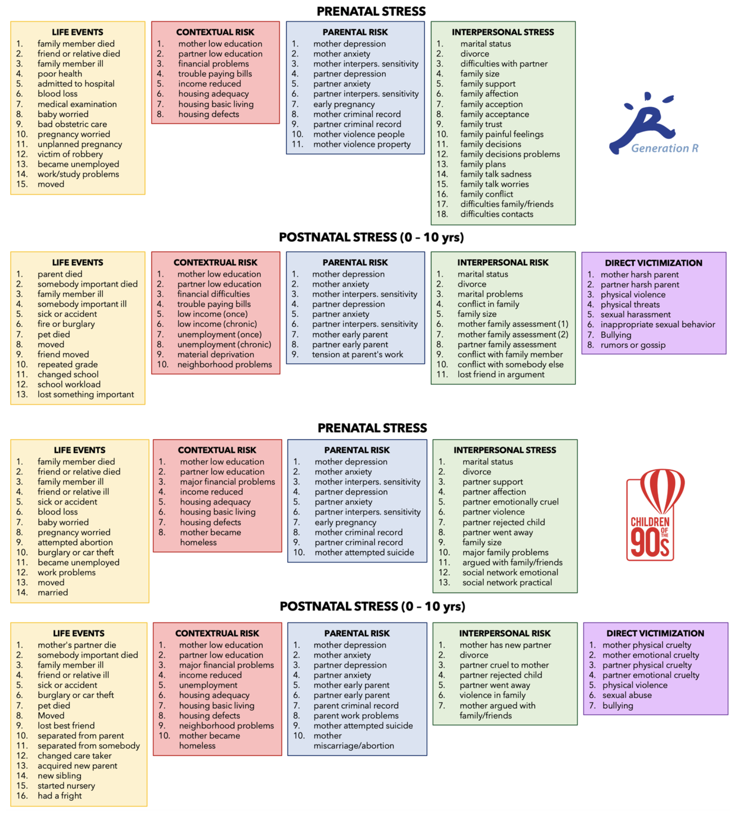
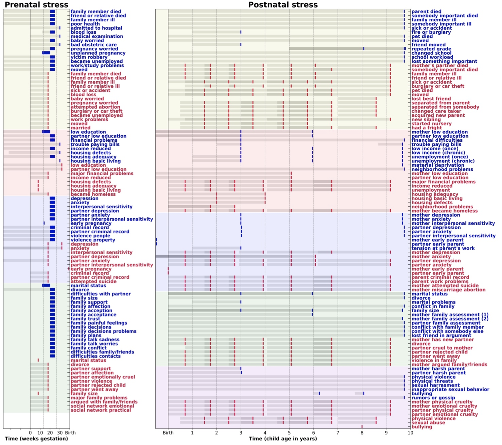
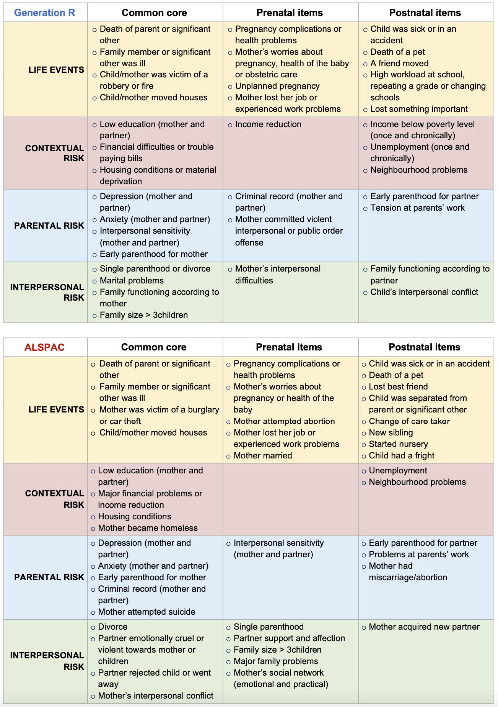
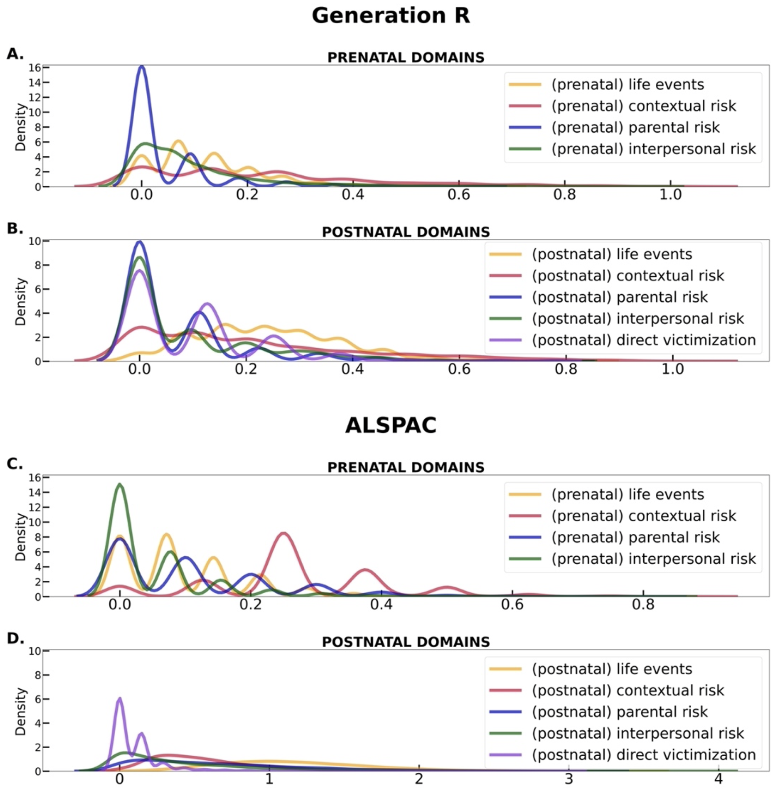

# cumulative-ELS-score
Hello there! 

Here are some facts about the development and characteristics of the ***prenatal*** and ***postnatal*** **early-life stress** (ELS) scores constructed for [this project](https://github.com/SereDef/association-ELS-PCM-project). These are global ELS measures, intended to capture exposure to **cumulative psycho-social risk** during fetal life and across childhood (i.e., until the age of 10 years) respectively. The scores were constructed based on data from [Generation R](https://generationr.nl/) and [ALSPAC](http://www.bristol.ac.uk/alspac/) cohorts.

## Score structure
Prenatal and postnatal stressors included in the scores were categorized into five stress domains, based on previous literature (Cecil et al., 2014; Rijlaarsdam et al., 2016): 
* `Life events` (e.g., death of a parent or pregnancy complications), 
* `Contextual risk` (e.g., financial difficulties or neighbourhood problems), 
* `Parental risk`(e.g., parental criminal record or parental depression), 
* `Interpersonal risk` (e.g., family conflicts or loss of a friend),
* `Direct victimization` (only available postnatally, e.g., bullying or maltreatment). 
Please have a look at [Figure 1](imgs/Figure1.png) for an overview of all the items included in each stress domain and [Figure 2](imgs/Figure2.png) for an illustration of the temporal structure of the score, i.e., when were the items measured and what is the period of time they refer to. 

> <ins>Figure 1</ins>: **Score overview.** Overview of all items included in the score for Generation R (above) and ALSPAC (below). Pre- and postnatal items were assigned one of five domains, indicated by the coloured boxes: Life events in yellow, contextual risk in red, parental risk in blue, interpersonal risk in green and direct victimization in purple.

> <ins>Figure 2</ins>: **Temporal structure of the prenatal and postnatal ELS score.** The two graphs summarize the complex temporal structure of the prenatal (on the left) and postnatal (on the right) ELS scores. Time is depicted on the x-axis on the scale of weeks (gestation) for prenatal and years for postnatal items. For each question/item on the y-axis, a coloured dot represents the timepoint(s) at which the item was measured, and a grey shadow indicates the time period the question refers to (e.g., “since pregnancy” or “in the last year”). Red dots and labels refer to ALSPAC items and blue dots/labels refer to Generation R items. For example, in Generation R, a question about experiencing “fire or burglary” was asked once when the child was 3 and it referred to the previous 2 years, i.e. “In the past two years, did the child experience a fire or burglary?”. In ALSPAC the item “burglary or car theft” was measured six times: around 2, 3, 4, 5, 6 and 9 years. Each of these measurements refer to the preceding 12 /15 months except for the last one, wish extends to 3 years prior. Items are grouped by domains, as indicated by the background color (yellow for life events, red for contextual risk, blue for parental risk, green for interpersonal risk and purple for direct victimization). The solid black vertical line indicates the beginning of the exposure period of interest, i.e., conception (or start of pregnancy) for prenatal items and birth for postnatal items. The dashed grey lines additionally provide temporal markers, i.e., trimesters in the prenatal period and a span of 1 year in the postnatal period.
 

## Score calculation
In each cohort (i.e., Generation R and ALSPAC), ~100 stress-related items were selected and dichotomised into *no risk* (=0) or *risk* (=1). The dichotomized items were assigned one of 9 stress domains (4 prenatal and 5 postnatal domains, as depicted in [Figure 1](imgs/Figure1.png) and a domain score was computed as the unweighted average of the items belonging to each domain:

**domain score = risk1 + risk2 + … + riskN / N**	(where **N** is the number of items in the score)

Finally, domain scores were summed within periods to obtain the prenatal and postnatal ELS scores used in the main analyses:
* **Prenatal stress** = `prenatal life events` + `prenatal contextual risk` + `prenatal parental risk` + `prenatal interpersonal risk`.
* **Postnatal stress** = `postnatal life events` + `postnatal contextual risk` + `postnatal parental risk` + `postnatal interpersonal risk` + `postnatal direct victimization`.

### Item selection
The score is designed to be a comprehensive measure of exposure to psycho-social stressors. We adopted a broad definition of ELS, including any event or situation with characteristics that would be considered stressful during early life (Heim, 2013). However, early stress factors that are more biological in nature (e.g. maternal smoking or alcohol consumption, pollution) were left out of the score. We preferred including these as covariates in our models, to explicitly account for their contribution.

Generally, items measured in the *prenatal* period were referred to the mother, i.e., they were selected to reflect any source of psychosocial stress for the pregnant mother; whereas *postnatal* items were meant to capture psychosocial stress in the child more directly. However, for a few postnatal ALSPAC items for which more “direct” assessment of child stressors was not available, some proximal items were used. These were referred to the mother, but presumably reflect the child experience to some extent, for example, whether the child’s parent died was not reported in ALSPAC, so the item: “the mother’s partner died” was used instead. A summary of the overlap between prenatal and postnatal items in each domain and for the two samples is provided in [Table 1](imgs/Table1.png). 

> <ins>Table 1</ins>. **Overlap between prenatal and postnatal items in each domain.**
 

When *multiformat* reports were available (i.e., reports from both parents, or mother and teacher) both sources of information were included, with the aim of reducing the impact of reporter bias as much as possible.

After a first screening of all stress-related questions available in each cohort, we collapsed highly similar/correlated questions to minimize multicollinearity and, at the same time, maximize comparability across cohorts. For example, in the ALSPAC score, the stressor “violence in family” was considered present if the answer was yes to either of these three questions: “Partner was physically cruel to Mum”, “Mum/Partner hit or slapped one another” and “Mum/Partner threw something in anger”. A complete report of the original questions and their combination into stress items is provided in [Table 3](imgs/Table3.xlxs) and [4](imgs/Table4.xlxs). 

This process resulted in a total of 52 prenatal and 51 postnatal items in Generation R, and 45 prenatal and 50 postnatal items included in the ALSPAC score (see [Figure 1](imgs/Figure1.png) and [2](imgs/Figure2.png)). 

### Dichotomization stratergies 
To ensure that all different risk items would contribute equally to the score, all items were recoded into *no risk* (=0) or *risk* (=1). About half of the Generation R items and 10% of ALSPAC items were already encoded as binary (i.e., yes or no), but for the remainder of the items some arbitrary decisions about what constitutes a risk (=1) or not (=0) had to be involved. The dichotomization strategy adopted for each item is reported in [Table 3](imgs/Table3.xlxs) and [4](imgs/Table4.xlxs). In most cases, decisions were guided by questionnaire manuals, European or national guidelines or available literature. Some of the main criteria are outlined here: 
* About 65% of all ALSPAC items had a similar 5-level structure: `“did not happen”` / `“no effect at all”` / `“mildly affected”` / `“fairly affected”` / `“affected a lot”`. These were dichotomized into *no risk* (=0) if the answer was `“did not happen”` and *risk* (=1) if any other answer was provided. This approach would ensure that the subjective evaluation of the impact of a stressor on the child (reported in most cases by mothers) would not factor into the score. The same principle was applied in Generation R, for instance, to questions about financial, housing or interpersonal problems (*no risk* = `“no problems”`, *risk* = `“slight”`, `“moderate”` or `“serious”` problems), or maternal criminal offence (*no risk* = `“never”`, *risk* = `“once”` / `“2-3 times”` / `“4-5 times”` / `“> 6 times”`).
* In the Dutch cohort (Generation R), **low education** and **low income** were defined according to the *Centraal Bureau voor de Statistiek* (2016). Paternal and maternal education was marked as a risk when the highest educational attainment was below `“higher education – phase 1”` (i.e., *risk* = `No education` / `Primary` / `Secondary-phase 1` / `Secondary-phase 2`). Low income was marked as a risk the household income was below the “basic needs” level (i.e., 1600 €/month). 
*	The **material deprivation** criterium was based on a possession rate < 75%, according to European statistics on income and living conditions (EU-SILC, 2007).
*	In Generation R, **maternal and paternal psychopathology** (i.e., depression, anxiety and interpersonal sensitivity) were measured using the Brief Symptom Inventory (BSI). Hence the sex and subscale specific cut-offs were indicated in the Dutch BSI manual (De Beurs, 2009). Similarly, in ALSPAC, the manuals of the Edinburgh Postnatal Depression Scale (EPDS) (Cox, Holden, & Henshaw, 2014) and the Crown-Crisp Experiential Index (CCEI) (Birtchnell, Evans, & Kennard, 1988) were consulted to determine clinical cut-offs for depression and anxiety respectively. 
*	The cut-off for unhealthy **family functioning**, measured postnatally in Generation R using the Family Assessment Device (FAD) was based on (Byles, Byrne, Boyle, & Offord, 1988).
* **Early parenting** was defined as a risk when the mother or father was younger than 19 years old at intake (Generation R) or delivery (ALSPAC), based on (Cecil et al., 2014; Rijlaarsdam et al., 2016). 
*	**Overcrowding** (i.e., family size) was included as a risk if more than four people were living in the same house, based on (Cecil et al., 2014; Cortes Hidalgo et al., 2020; Rijlaarsdam et al., 2016).
*	**Bullying** was considered a risk when any type of bullying (i.e., physical, verbal or relational) was reported by any informant (i.e., mother or teacher) at least once a week, based on (Muetzel et al., 2019).
* When no other cut-off was available, an 80th percentile cut-off was used in the dichotomization of maternal and paternal **interpersonal sensitivity**, and **neighborhood problems** in ALSPAC and that of maternal and paternal **harsh parenting** in Generation R, as suggested by (Jansen et al., 2012).

### Repeated measures
As evident from the right pane in [Figure 2](imgs/Figure2.png) (listing postnatal exposures), the two cohorts show different profiles in terms of availability of repeated measurements. In Generation R, none of the prenatal and 16 of the 51 postnatal items were measured more than once:
*	Education of the mother and of partner were both measured twice (at ~3 and ~6 years);
*	Financial difficulties, trouble paying bills and psychopathology of the mother and partner (i.e., depression, anxiety and interpersonal sensitivity) were measured twice (at ~3 and ~9½ years);
* Bullying was measured when the child was ~6 and ~8 years old;
* Mothers reported on general family functioning when the child was ~6 and ~9½ years old;
*	Income, employment status, marital status of the mother and family size were each measured 3 times (at ~3, ~6 and ~9½ years);
*	Repeating a grade was measured 3 times (at ~8 years and twice at 9½ – 10 years).

In ALSPAC, while only two prenatal items had repeated measurements (i.e., maternal depression and anxiety were measured in the second and third trimester), the majority of the postnatal stressors had 6 or 7 repeated assessments. The only exceptions being:
*	Maternal anxiety and child starting nursery (for which only 5 measurements were available);
*	Housing conditions and neighborhood problems, measured twice around ~2 and ~3/4 years;
* Single measurements for: losing a best friend (~8½ years), mother and partner education (~5 years), mother and partner “early parenthood” (at delivery) and bullying (~8 years).

To best leverage data characteristics of each cohort, we therefore decided to adopt a different strategy with respect to handling repeated measurements of postnatal stressors, in Generation R and in ALSPAC.

In Generation R postnatal repeated measures were combined using a *‘once a risk, always a risk’* strategy. For example, repeated a grade was encoded as 1 (=risk), whenever a stressor was present at any of the available timepoint, and it was encoded as 0 (=no risk) if the stressor was absent at all timepoints. There were two exceptions to this rule: 
* (i)	**low income** and **unemployment** we additionally combined into *“chronic”* low income and unemployment items. These were coded as 1 when the stressor was present on all timepoints, and as 0 if the stressor was absent at any of the three timepoints. This was done because we believe the exposure to an unstable financial situation that is prolonged in time may be a different type of stress exposure. This also implies that low income and unemployment, when experienced chronically, had a bigger impact on the total contextual risk score. 
* (ii)	the two assessments of **family functioning** according to mothers (at ~6 and ~9½ years) were included in the score as separate stress indicators. Following as similar rationale as for the income and employment variables, we decided not to combine the two measurements, to capture the greater impact that a prolonged exposure to unhealthy family dynamics might exert on interpersonal stress. 

In ALSPAC, we believe that adopting the same approach would have been wasteful, considered the richness of postnatal repeated assessments that the cohort provides (i.e., a total of 288 measures across the 50 stressors). Therefore, we did **not** collapse postnatal repeated assessments using a *‘once a risk, always a risk’* strategy but rather we summed all available timepoints as individual items in the domain score, and then divided this sum by the number of stressors in the score: 
i.e., **domain score = risk11 + risk12 + … + risk1t1 + risk21 + … + risk2t2 + … + riskNtN / N**
where N is the number of stressors in the score and tn is the total number of timepoints available for each stressor. 
As a result, while in Generation R higher postnatal stress scores reflect mainly the co-occurrence of multiple types of stressors, ALSPAC postnatal scores also reflect the chronicity of stress exposure.

### Domain scores distribution and correlational structure
The univariate distributions of each of the nine domains are illustrated in [Figure 3](imgs/Figure3.png). 

> <ins>Figure 3</ins>: **Distribution of domain scores in the two cohorts.** 
The four graphs illustrate the univariate distribution of the prenatal and postnatal domain scores in the Generation R (A, B) and the ALSPAC (C, D) samples. Color indicates the domain (yellow for life events, red for contextual risk, blue for parental risk, green for interpersonal risk and purple for direct victimization).
 

From the graphs one can appreciate a positive skewness across nearly all domains, that is expected given the population-based samples these distributions are constructed on, i.e., a large proportion of the sample will have low cumulative stress scores. This skewness seems less pronounced in the ALSPAC sample, which could indicate higher rates of cumulative stress. For the prevalence of each individual stressor in the score, see [Table 3](imgs/Table3.xlxs) and [4](imgs/Table4.xlxs). 

The Pearson correlation matrix relating all domain scores as well as prenatal and postnatal total stress scores is shown in [Figure 4](imgs/Figure4.png). 

> <ins>Figure 3</ins>: **Stress score correlation matrix.**
The Pearson correlation matrix relating all prenatal and postnatal domain scores as well as pre- and postnatal total stress scores. In the lower left corner, indicated by the color blue are the correlations referred the Generation R sample while in the upper right corner, in red are the ALSPAC correlations. The black grid divides the matric in 3 sections: prenatal domains, postnatal domains and total scores. 
 

Of note is the high correlation between pre- and postnatal total scores (r = 0.56 in Generation R and 0.48 in ALSPAC), and the Generation R-specific continuity that emerges between prenatal and postnatal contextual risk (r = 0.65). In ALSPAC contextual risk and parental risk also show some continuity across prenatal and postnatal periods (r = 0.40 and 0.43 respectively).

The partitions of individual stressors into the proposed domain structure received some support from the Confirmatory Factor Analyses implemented in the Generation R sample (see [Table 2]()). 

> <ins>Table 2</ins>: **CFA results.**
| _Domain_                       | _RMSEA_ | _SRMR_ | _CFI_ |
| ------------------------------ | ------- | ------ | ----- |
| Prenatal Life events           | 0.03    | 0.04   | 0.71  |
| Prenatal Contextual risk       | 0.09    | 0.07   | 0.87  |
| Prenatal Parental risk         | 0.04    | 0.09   | 0.80  |
| Prenatal Interpersonal risk    | 0.03    | 0.06   | 0.93  |
| Postnatal Life events          | 0.04    | 0.04   | 0.49  |
| Postnatal Contextual risk      | 0.07    | 0.07   | 0.92  |
| Postnatal Parental risk        | 0.05    | 0.11   | 0.81  |
| Postnatal Interpersonal risk   | 0.05    | 0.07   | 0.90  |
| Postnatal Direct victimization | 0.06    | 0.08   | 0.46  |

### Why a cumulative ELS score?
Cumulative scores, similar to this one, are widely used in developmental psychology and medicine because they proved to be a parsimonious and statistically sensitive metric. They make no assumptions about the relative strengths of multiple risk factors or their collinearity, and they tend to fit well with underlying theoretical models (Evans, Li, & Whipple, 2013). 
### Limitations
Additive indexes such as this one also come with a number of shortcomings. Importantly, risk was inevitably designated with some degree of arbitrariness, and dichotomization into risk or no risk was not always a straightforward decision. Because we are aware of how problematic this may be for replicability, we tried to list as meticulously as possible the decisions that were taken and the rationale behind each one of them. Note also that information on risk intensity is lost, together with the effect of specific stressors, that of temporal trajectories and the possibility of statistical interactions between stressors. Furthermore, the inclusion of stressors in the score was inevitably limited by the availability of data, and, despite our best efforts to be as comprehensive as possible, it may still leave out important factors. Finally, the information included in the score relies predominately on mother reports, and although other information sources (e.g., partner or teacher reports) were included, when possible, reporter bias is still one of the key issues of this measurement. 
### Other applications
This score was originally conceived and used by Cecil et al., 2014; Rijlaarsdam et al., 2016; and Schuurmans et al., (in preparation). Similar versions of the score including prenatal and postnatal components have been succesfully used to predict later mismatch between cognitive abilities (i.e. IQ) and accademic achievement in Generation R children (Schuurmans et al., in preparation). Exposure to prenatal ELS was examined in relation to DNA methylation (DNAm) at birth, as a proxy of stable epigenetic changes (Rijlaarsdam et al., 2016), but no robust assocaitions we found. However, we are further examining whether prenatal ELS in interaction with genetic predisposition may have better explainatory power over DNAm patterns (Mulder et al., in preparation). Note that a parallel version of the postnatal ELS score, spanning from birth to 6 years of age, was created in Generation R and was examined in relation to internalizing and externalizing behavior (moderated by temperament and executive functioning; de Maat et al, in preparation) and problem behavior (measured with the Berkeley puppet interview). 

> <ins>Table 3</ins>: List of all prenatal items included in the Generation R (marked in blue) and in ALSPAC (marked in red). The items are divided into their respective domains and ordered according to closest item similarity across cohorts. The table includes information about the variable names assigned to individual items (i.e., those used in the scripts); the original question(s) used to construct the items (when more than one question was combined this is indicated by the || sign, reads as “or”); the dichotomization applied to each item (i.e., risk or no risk); the timepoint of measurement; and prevalence of the risk in its respective sample (the percent of missing values also reported in grey between square brackets). 

[See Table 3](imgs/Table3.xlxs).

> <ins>Table 4</ins>: List of all postnatal items included in the Generation R (marked in blue) and in ALSPAC (marked in red). The items are divided into their respective domains and ordered according to closest item similarity across cohorts. The table includes information about the variable names assigned to individual items (i.e., those used in the scripts); the original question(s) used to construct the items (when more than one question was combined this is indicated by the || sign, reads as “or”); the dichotomization applied to each item (i.e., risk or no risk); the timepoint(s) of measurement; and prevalence of the risk factor in its respective sample (with percent of missing values in grey between square brackets). In ALSPAC, since individual timepoints are not collapsed, a range of prevalences is provided.

[See Table 4](imgs/Table4.xlxs).

### Imputation stratergy
For details please see the sister repo: https://github.com/SereDef/association-ELS-PCM-project