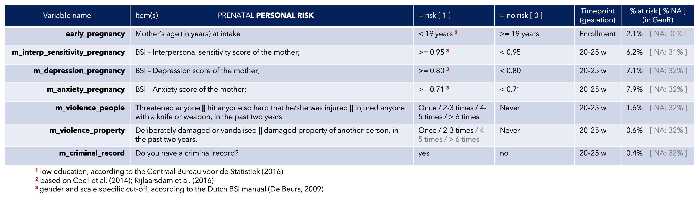
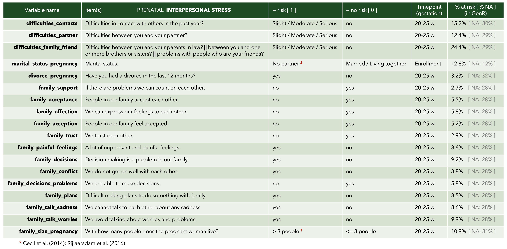
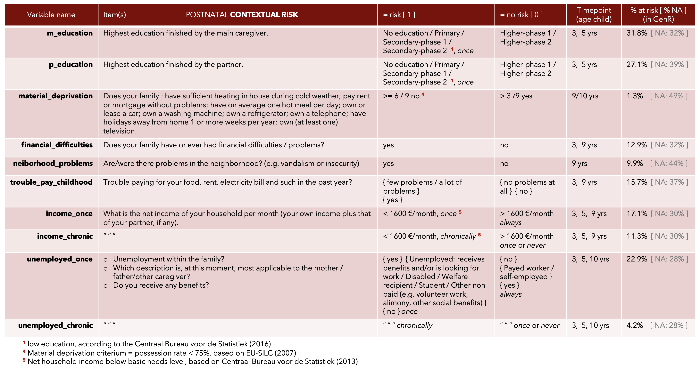

# cumulative-ELS-score
Hello there! 
Here you can find a set of scripts for building a **cumulative psycho-social risk exposure** score spanning across two developmental periods (during ***pregnancy*** and across ***childhood***) and attempting to capture a global and additive measure of Early-life stress (ELS). 

Prenatal and postnatal ELS scores are composed of five cumulative (additive) risk domains: **Life events** (e.g. death of a parent or pregnancy complications), **contextual risk** (e.g. financial difficulties or neighbourhood problems), **parental risk** (e.g. parental criminal record or parental depression) and **interpersonal risk** (e.g. family conflicts or loss of a friend) and ***direct victimization*** (only available postnatally, e.g. bullying or harsh parenting). Each domain is constructed by dichotomizing the belonging risk factors (0 = no risk; 1 = risk) and then summing the dichotomous scores.

These scores are based on Generation R (https://generationr.nl/) and ALSPAC (http://www.bristol.ac.uk/alspac/) data on (from pregnancy to 7-10 years of age). They have been originally conceived and used by Cecil et al., 2014; Rijlaarsdam et al., 2016; and Schuurmans (in preparation). All indicators were harmonized across Generation R and ALSPAC cohorts with respect to closest item-similarity. 

Keep reading if you want to find out more about this score. We will try to outline advantages and disadvantages of using it, the outcomes that have already been related (or not) to it, and track and trace the decision process behind every step of it's construction. If something is unclear, or if you can spot any mistake, please contact me. Any input is very welcome! 

## Why should you consider using a cumulative ELS score to begin with?
Cumulative scores, similar to this one are widely used in developmental psychology and medicine because they proved to be a *parsimonious* and statistically sensitive metric. They make no assumptions about the relative strengths of multiple risk factors or their collinearity, and they tend to fit well with underlying theoretical models. Of course, they also come with a number of shortcomings, that you should be aware of before deciding to use the score. (check e.g. Evans, Li and Whipple, 2013).

## Shortcomings (and patches!) of using this score
As his fellow additive indices, this one also has quite a few shortcomings. Importantly, for example, risk is inevitably designated with some degree of *arbitrariness*, and dichotomization into risk or no risk was not always a straightforward decision. Because we are aware of how problematic this may be for replicability, we tried to list as meticulously as possible the decisions that were taken and the rationale under each one of them. Note also that information on *risk intensity* is lost, together with the possibility of statistical interactions between risk factors.

## Score overview

Some items are mirrowed in prenatal and postnatal corresponding domains, but some are more period-specific. Here is an overview: 

Let's take a look at the correlation matrix of the whole score. The black and blue lines can help you orient between the dirrent domains and periods. Those depicted here are Spearman correations. 

## Prenatal stress: raw items and prevalence

## Postnatal stress: raw items and prevalence

## Prediction of negative health outcomes, what do we know so far
A similar version of the score has been used to predict cognitive develpment ... multimorbidity between internalizing problems and cardio-metabolic risk in children 

## Decision dictionary: item inclusion / exclusion and dichotomization stratergies 
Manual reference ...
